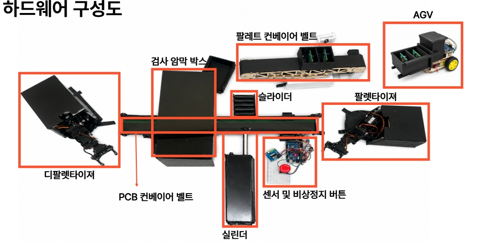
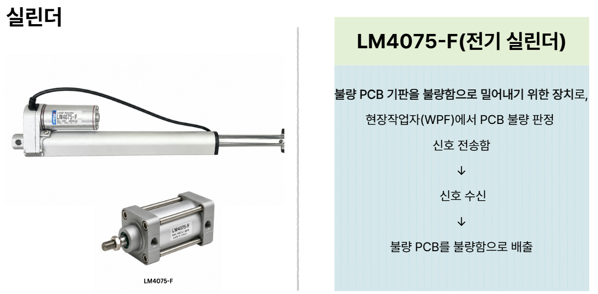
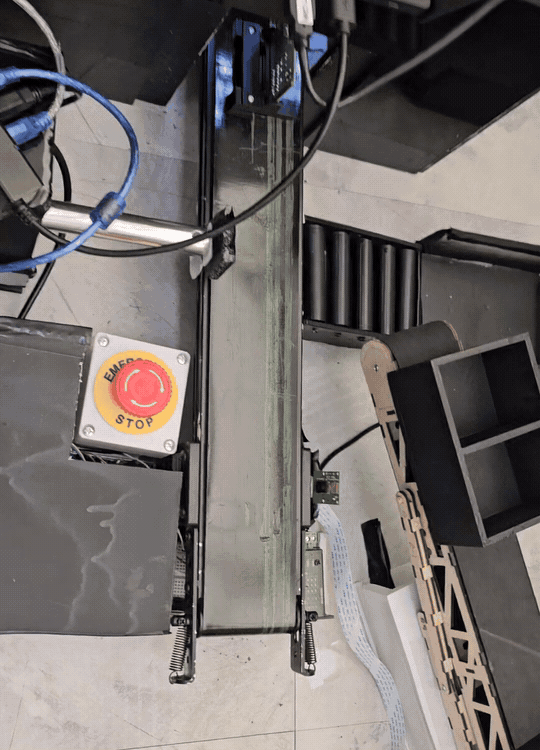
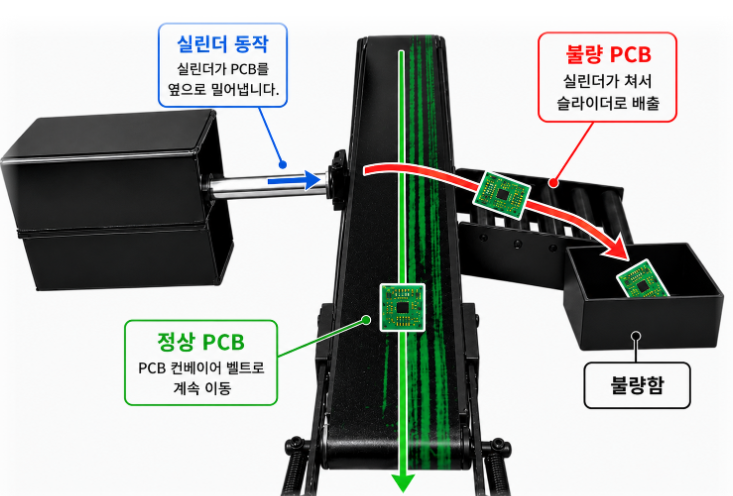
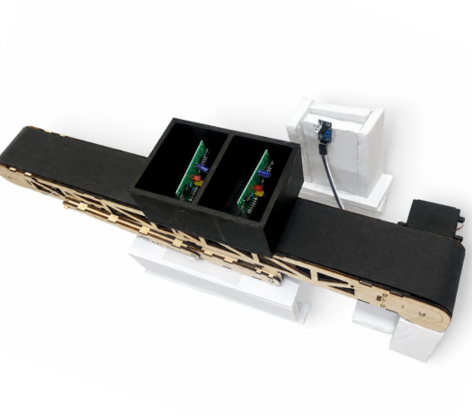
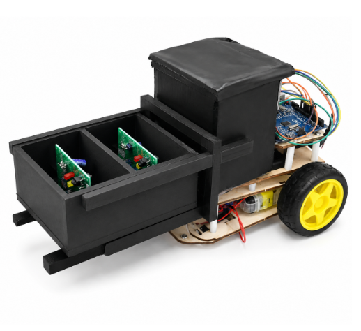

# PCB Automation System

AI 비전 검사 결과와 컨베이어, 실린더, 로봇팔, AGV를 연결해 PCB 검사와 물류 이송을 자동화한 최종 프로젝트입니다.

정상 PCB는 컨베이어를 따라 적재 위치로 이동하고, 불량 PCB는 실린더가 밀어내도록 구성했습니다.  
로봇팔이 정상 PCB를 팔레트 이송용 컨베이어 벨트에 있는 팔레트에 다 적재 하면 컨베이어 밸트가 AGV가 있는곳 까지 움직이며 AGV가 제품을 지정된 위치까지 운반합니다.

## 시스템 동작 순서

1. 투입 위치의 로봇팔이 PCB 기판을 집어 메인 컨베이어 벨트 위에 올립니다.
2. 메인 컨베이어가 PCB 기판을 검사 위치까지 이동시킵니다.
3. 카메라가 PCB의 정상 여부를 검사합니다.
4. 검사 결과가 불량이면 실린더가 작동하여 PCB를 컨베이어 옆으로 밀어냅니다.
5. 검사 결과가 정상이면 PCB는 메인 컨베이어 끝까지 계속 이동합니다.
6. 메인 컨베이어 끝에 있는 로봇팔이 정상 PCB를 집습니다.
7. 로봇팔이 정상 PCB를 팔레트 이송형 컨베이어 위에 놓인 팔레트에 적재합니다.
8. 박스에 정해진 수량의 PCB가 적재되면 팔레트 이송형 컨베이어가 작동합니다.
9. 팔레트 이송형 컨베이어가 PCB가 담긴 박스를 AGV 지게차의 하강 위치까지 이동시킵니다.
10. AGV 지게차가 박스를 들어 올린 뒤 라인을 따라 창고로 이동합니다.
11. AGV 지게차가 창고의 지정된 위치에 박스를 내려놓습니다.
12. 운반을 완료한 AGV 지게차는 다시 컨베이어 앞의 초기 위치로 복귀합니다.
13. 같은 공정을 반복합니다.
14. 비상정지 신호가 발생하면 컨베이어, 로봇팔, 실린더 및 AGV의 동작을 정지합니다.

## 회로도

## 메인 제어 회로

Arduino Mega, 모터 드라이버, 스테핑 모터 드라이버, 센서와 부저를 연결한 회로입니다.

## AGV 회로

Arduino UNO R4 WiFi, 주행 모터, 모터 드라이버, 초음파 센서와 서보모터를 연결한 회로입니다.

## 컨베이어 회로

Arduino Uno, 적외선 센서, 모터 드라이버와 컨베이어 모터를 연결한 회로입니다.

## 실린더 배출 PLC Ladder 프로그램

불량 판정 신호가 들어오면 실린더 전진 출력이 동작하도록 OpenPLC 기반 Ladder 프로그램을 작성했습니다.

Pin Mapping에서 전진 출력(`Fwd_Pin`)과 후진 출력(`Bwd_Pin`)을 설정했으며, 실제 동작에서는 불량 PCB를 컨베이어 옆으로 밀어내는 역할을 수행합니다.

## 하드웨어 구성

PCB 검사, 불량품 배출, 정상품 적재 및 창고 운반에 사용한 전체 하드웨어 구성입니다.

---

## 불량 PCB 배출 실린더

---

## PCB 분류 동작

---

## 팔레트 이송형 컨베이어

---

## AGV 지게차

## 소스 코드

| 파일 | 내용 |
|---|---|
| `AGV.ino` | AGV 출발, 후진, 회전과 주행 제어 |
| `Conveyor.ino` | 적외선 센서 감지와 컨베이어 제어 |
| `Cylinder.ino` | 불량 PCB 배출 실린더와 통신 제어 |

## 주요 기능

- PCB 검사 결과에 따른 자동 분류
- 적외선 센서를 이용한 PCB 감지
- 컨베이어 모터 시작 및 정지
- 불량 PCB 실린더 배출
- AGV 주행과 제품 운반
- 보드 사이의 시리얼 통신
- 비상정지와 부저 경고
- 온도와 습도 상태 전송

## 내가 맡은 부분

- 센서와 모터 배선
- Arduino 제어 코드 작성
- 컨베이어 모터 제어
- 불량 PCB 실린더 배출 기능
- AGV 모터 제어와 이동 순서 작성
- 장비 사이 통신 연결
- 전체 동작 테스트와 오류 수정
- 회로도와 발표자료 제작

## 개발 환경

- Arduino Uno
- Arduino Mega
- Arduino UNO R4 WiFi
- Arduino IDE
- C/C++
